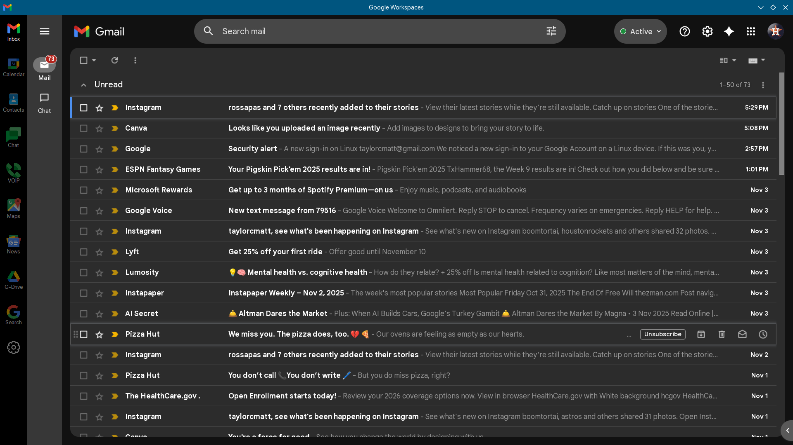

### Google Workspaces Qt Web View App

* Included apps - gmail,gcal,contacts,chat,voip,news,maps,drive,search
* Login with google id/password and verify with 2FA on your phone
* KDE Linux distro required as QT 6 is used to create the web views
* With all the google privacy issues keep google out your normal web browser
* Using qml web engine, google logins and trackers are separated from normal web browsing
* NOTE: Google account password is saved encrypted in: ``` $HOME/.local/share/QtProject/Qml Runtime/QtWebEngine/gmail/ ```
* Added a clear cache settings button
* Create app launcher w/
```
qml6 --quiet --qwindowicon $HOME/G-Mail/icons/gmail.png $HOME/G-Mail/gmail.qml
```
* https://github.com/txhammer68/gmailWorkpace




<br>
All trademarks, trade names, or logos mentioned or used are the property of their respective owners. Every effort has been made to properly capitalize, punctuate, identify and attribute trademarks and trade names to their respective owners, including the use of ® and ™ wherever possible and practical. The “Workspace” name and associated logos and marks are trademarks and the property of Google Corporation. All other trademarks are the property of their respective owners.
