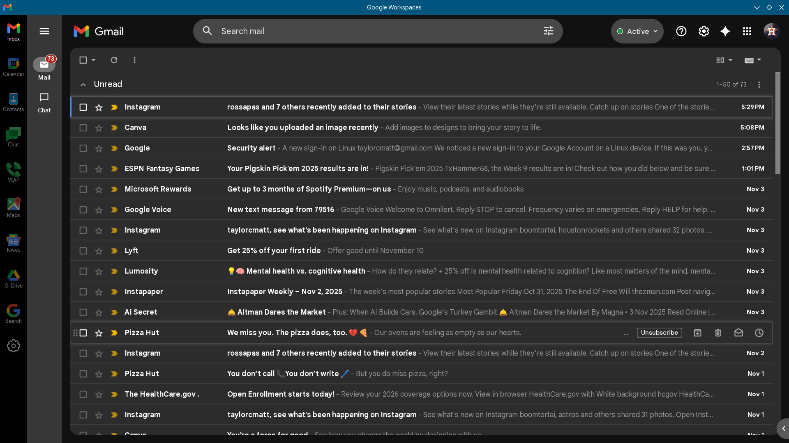

### Google Workspaces Qt Web View App

<p align="left">
    
    
</p>

* Included apps - G-Mail,G-Calendar,Contacts,Chat,Voice,News,Maps,Drive,Search

* Requirements: KDE Plasma 6, qt6-webengine, qt6-webview

* Download repo to: $HOME\G-Mail <br>
 ``` bash git clone https://github.com/TxHammer68/gmailWorkpace /$HOME/G-Mail ```

* Create app launcher w/ <br>
 ``` bash qml6 --quiet --qwindowicon $HOME/G-Mail/icons/gmail.png $HOME/G-Mail/main.qml ```

* Login with google id/password and verify with 2FA on your phone
 
* NOTE: Google account info/password is saved encrypted in: <br>
``` $HOME/.local/share/StandaloneApps/GoogleWorkSpaces/QtWebEngine/gmail/ ```



<br>
<sub><sup> All trademarks, trade names, or logos mentioned or used are the property of their respective owners. Every effort has been made to properly capitalize, punctuate, identify and attribute trademarks and trade names to their respective owners, including the use of ® and ™ wherever possible and practical. The “Workspace” name and associated logos and marks are trademarks and the property of Google Corporation. All other trademarks are the property of their respective owners.</sup></sub>
